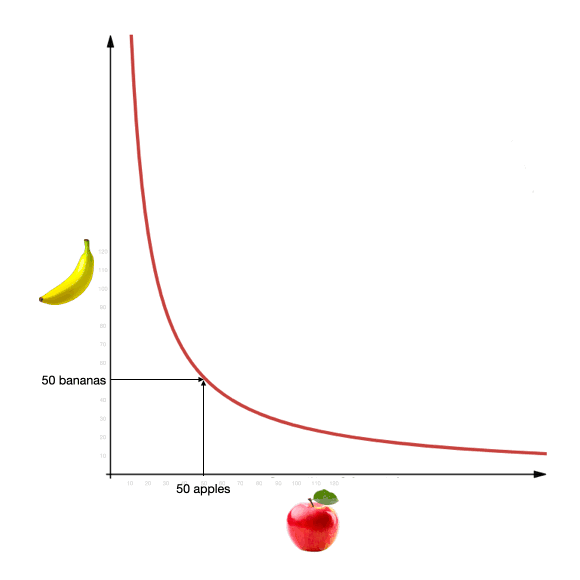

# 主流 DEX--Uniswap介绍
---

                                                                                                    author：甘赞栩
## 引入
以太坊 1.0 的严重限制让简便的 Uniswap 脱颖而出，但以太坊 2.0 和 L2 链下系统将使更复杂的市场蓬勃发展。
想象一下，有个大学时的朋友联络你说："嘿，我有个商业设想。我想开发一个做市机器人。不管谁来询价，我随时都能报出一个价格，我的定价算法会用 x * y = k。差不多就这些。想投资吗？"你会躲得远远的。 
其实，你朋友刚才描述的就是 Uniswap。Uniswap 也许是世界上最原始的链上做市商运作。莫名其妙的，它的交易量过去几个月出现爆发式增长，凭交易量已成为世界最大的去中心化交易所（DEX） 。

## 展开
Uniswap 是一个自动做市商，即 AMM。你可以把 AMM 设想成一个原始的、机器人式的做市商，它根据一个简单的定价算法，在两种资产之间随时提供报价。对 Uniswap 而言，它对这两种资产进行报价，其持有的每种资产的单位数相乘，总会等于一个常数。如果 Uniswap 拥有一些 x 代币，拥有一些 y 代币，它给每一笔交易定价，所以，它拥有的 x 的最终数量，和拥有的 y 的最终数量，两者相乘会等于一个常数 k。这就形成了一个常数积的等式：`x * y = k`。
这种对两种资产进行定价的方式，你可能会觉得非常怪异且过于独断。让两种代币的库存数相乘所得的积维持固定，为什么就能确保正确的报价呢？ 
下面我们就通过一个简单的例子了解一下Uniswap
* **Uniswap 示例**
    假设我们在 Uniswap 的某个池里投入 50 个苹果 （a） 和 50 个香蕉 （b） ，任何人都可以用苹果换香蕉，或者用香蕉换苹果。假设一级市场中苹果与香蕉的汇率刚好是 1:1。因为该 Uniswap 资金池中分别有 50 个苹果和 50 个香蕉，因此，按上述常数积的等式规则，a * b = 2500 。对于任何交易，Uniswap 都需要保证，池中库存的苹果数和香蕉数相乘等于 2500。 
    假设一位客户进入我们的 Uniswap 池来买一个苹果。她应该支付多少个香蕉呢？如果她买走一个苹果，我们的池里就剩下 49 个苹果，而 49* b 依然需要等于 2500。这样香蕉的总数 b 就等于 51.02。由于之前池中有 50 个香蕉，因此我们还需要 1.02 个香蕉（在这个宇宙中我们允许碎片化香蕉的存在） ，因此，这位客户买一个苹果会得到的报价是：1.02 香蕉 / 苹果。

    >请注意，这与两者之间 1:1 的原始价格很接近！因为这只是一笔小额交易，所以滑点较小。

    

    如果她想买 10 个苹果， Uniswap 的报价会是 12.5 个香蕉，即这 10 个苹果每个的单价为 1.25 香蕉 / 苹果。如果她想要执行 25 个苹果这种大额交易，即要买库存苹果数量的一半，那么，单位价格会上涨到 2 香蕉 / 苹果！ 
    >可以看到当交易额变大，交易价格就会比原始价格成倍增长

* **抢先交易攻击（三明治攻击）的引申**
    在上面对Uniswap的介绍中其实我们可以发现一个好玩的地方。 
    如果苹果与香蕉之间的真实交易价格是 1:1，当第一位客户买走 10 个苹果后，我们 Uniswap 池就有会变成 40 个苹果和 62.5 个香蕉。如果有位**套利者**此时进入，她买走 12.5 个香蕉，让资金池恢复到最初状态，她只需付 10 个苹果，所以 Uniswap 对她的收费只有 0.8 苹果 / 香蕉。
    不难发现，Uniswap 会低价甩卖香蕉！就好像我们的算法此时意识到香蕉过多，所以它低价抛售香蕉，以吸引苹果流入，从而实现库存的再平衡。
    >抢先交易攻击正是利用了这一特性，来赚取"差价"
    具体的抢先交易攻击我会放到下一章来讲

* 套利损失（Impermanent Loss）简介

    下面你将了解 Uniswap 定价机制的工作方式。但这仍然引出一个问题——Uniswap 很好的完成了它工作吗？这东西真的会产生利润吗？毕竟，任何做市商都可以报价，但是否赚钱就不好说了。 
    答案是：取决于具体情况！具体来说，这取决于一种被称为**套利损失**的概念。它的运作方式如下：
    Uniswap 会对每笔交易收取少量费用 （目前为 0.3%） 。这是在名义价格之外的。因此，如果苹果和香蕉总是且永远以 1:1 价格进行交易，随着做市商在交易价格曲线上来回移动，这些费用将随时间累积。那么，与只持有 50 个苹果和 50 个香蕉的基线比较，Uniswap 池最终会积累更多的水果。 
    但是，如果苹果和香蕉之间的真实交易价格突然发生变化，会发生什么呢？假设某家香蕉农场遭遇了无人机攻击，出现大面积的香蕉短缺。香蕉现在像黄金一样贵。交易价格蹿升到 5 个苹果换 1 个香蕉。 
    Uniswap 上会发生什么？ 
    套利者一秒都不会耽搁，立马杀入你的 Uniswap 池，抢购便宜的香蕉。他们调整交易规模，以便买走价格低于新汇率 5:1 的所有香蕉。这意味着他们需要移动价格曲线，直到满足以下等式：5x * x = 2500。 
    
    算一下这个数学题，你会得到如下结果：他们总共以 61.80 个苹果买到 27.64 个香蕉。平均交易价格为 2.2 个苹果：1 个香蕉，这远低于市场价，相当于得到 76.4 个免费苹果。
    >这种现象称为「套利损失」。每当交易价格发生变动，就会出现套利者窃取廉价资产，直到资金池的定价达到正确为止。 

# 结束
自 2018 年上线以来， Uniswap 已经席卷 DeFi 领域。考虑到 Uniswap 的原始版本只有大约 300 行代码，这一成绩尤其令人惊讶！ （AMM 本身拥有历史悠久的血统，但是常数函数做市商是一个相对较新的发明。） Uniswap 完全无需许可，任何人都可以注入资产。它甚至不需要预言机。回顾一下会发现它非常优雅，是可能发明的最简单的产品之一，它似乎从石头缝里诞生，并主导了 DeFi 领域。