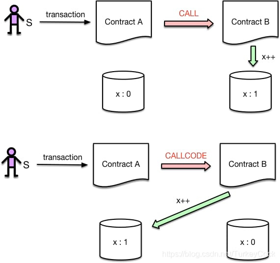
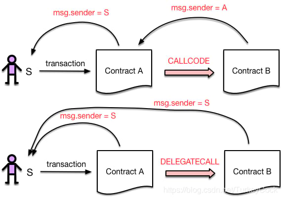

# Solidity之DelegateCall
在Solidity中，如果只是为了代码复用，我们会把公共代码抽出来，部署到一个library中，后面就可以像调用C库、Java库一样使用了。但是library中不允许定义任何storage类型的变量，这就意味着library不能修改合约的状态。如果需要修改合约状态，我们需要部署一个新的合约，这就涉及到合约调用合约的情况。
## 三种调用函数
  在 Solidity 中，call 函数簇可以实现跨合约的函数调用功能，其中包括 call、delegatecall 和 callcode 三种方式。<br/>

  他们的异同点如下：
  * **call**: 调用后内置变量 msg 的值会修改为调用者，执行环境为被调用者的运行环境
  * **delegatecall**: 调用后内置变量 msg 的值不会修改为调用者，但执行环境为调用者的运行环境（相当于复制被调用者的代码到调用者合约）
  * **callcode**: 调用后内置变量 msg 的值会修改为调用者，但执行环境为调用者的运行环境
  >注意："callcode"已被弃用，取而代之的是" delegatcall "

  * **CALL vs. CALLCODE**
  >CALL和CALLCODE的区别在于：代码执行的上下文环境不同。

  具体来说，CALL修改的是被调用者的storage，而CALLCODE修改的是调用者的storage。
  
  * **CALLCODE vs. DELEGATECALL**
  可以认为`DELEGATECALL`是`CALLCODE`的一个bugfix版本，官方已经不建议使用`CALLCODE`了。<br/>
  >CALLCODE和DELEGATECALL的区别在于：msg.sender不同。

  具体来说，DELEGATECALL会一直使用原始调用者的地址，而CALLCODE不会。
   

# delegatecall的细节问题
  先来看一段代码：
  ```
  contract calltest {
    address public c;
    address public b;
 
    function test() public returns (address a){
        a=address(this);
        b=a;
 
    }
  }
  contract compare {
      address public b;
      address public c;
      address testaddress = address of calltest;
      function withdelegatecall(){
          testaddress.delegatecall(bytes4(keccak256("test()")));
      }
  }
  ```
  看起来似乎没什么问题，但是两个合约的b与c向量的位置不同，我们来看一下执行的结果.
  b没有被赋值，反而是c被赋值了。
  在这里我们要关注一个EVM层面的问题，**如何保存字段变量到存储**

  简单来说，EVM为字段变量分配槽号（slot number），第一个被申明的占0号槽位，以此类推。
  >在EVM中，它在智能合约存储中有2^256个插槽，每个插槽可以保存32字节大小的数据。 

  <br/>
  我们知道使用delegatecall时代码执行的上下文是当前的合约，这代表使用的存储也是当前合约，当然这里指的是storage存储，然而我们要执行的是在目标合约那里的opcode，当我们的操作涉及到了storage变量时，其对应的访存指令其实是硬编码在我们的操作指令当中的，而EVM中访问storage存储的依据就是这些变量的存储位，对于上面的合约我们执行的汇编代码为sload——即访存指令，给定的即访问一号存储位，在我们的主合约中即对应变量c，在calltest合约中则对应于变量b，所以事实上调用delegatecall来使用storage变量时其实依据并不是变量名而是变量的存储位，这样的话我们就可以达到覆盖相关变量的目的

  参考：
  [delegatecall杂谈](https://blog.csdn.net/Fly_hps/article/details/81218219)